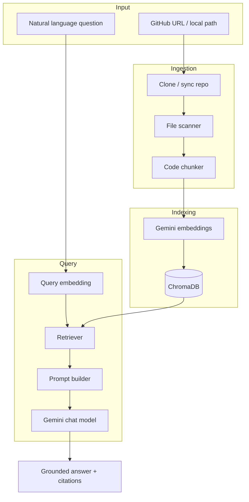

# Architecture

This document describes the system design for GitHub Repository Chat: a RAG pipeline tailored to source code in GitHub repositories.

## Goals

- **Accuracy** — Answers grounded in actual repository content, with citations.
- **Scalability** — Handle repos from a few hundred files to tens of thousands via batching and filtering.
- **Simplicity** — Start with a local-first, single-user CLI; avoid premature microservices.
- **Extensibility** — Clear module boundaries so a web UI or API can be added later without rewriting core logic.

## Non-goals (v1)

- Real-time sync with GitHub webhooks
- Multi-user auth and hosted SaaS
- Cross-repo federated search (multi-repo is supported; federated ranking is not)
- Fine-tuned or custom embedding models

---

## High-level architecture



---

## Core components

### 1. Configuration (`config.py`)

Centralized settings via `pydantic-settings`:

- API keys and model names
- Chunk size, overlap, and `TOP_K`
- Paths for Chroma persistence and cloned repos
- Default ignore patterns (`.git`, `node_modules`, `venv`, binaries)

All downstream modules receive a `Settings` object rather than reading env vars directly.

### 2. GitHub ingestion (`ingestion/github.py`)

**Responsibilities**

- Accept a GitHub URL (`owner/repo`) or local filesystem path
- Shallow clone (`git clone --depth 1`) into a cache directory keyed by repo slug
- Optional `--branch` / `--commit` pin for reproducible indexes
- Use `GITHUB_TOKEN` when present for private repos and clone rate limits

**Output:** Path to a local working tree.

### 3. File scanner (`ingestion/scanner.py`)

**Responsibilities**

- Walk the tree respecting `.gitignore` (use `pathspec` or `git check-ignore`)
- Include common source extensions: `.py`, `.js`, `.ts`, `.tsx`, `.go`, `.rs`, `.java`, `.md`, etc.
- Skip files over a size threshold (e.g. 500 KB) and binary files
- Emit `FileRecord` objects: `{ path, language, content, repo_id, commit_sha }`

**Design choice:** Index markdown and config files alongside code — they often document architecture and are valuable for "how does X work?" questions.

### 4. Code chunker (`ingestion/chunker.py`)

Code needs structure-aware splitting; naive fixed-size splits break functions mid-body.

**Phase 1 (MVP):** Language-agnostic sliding window

- Split on blank lines and brace boundaries where possible
- Target ~400–512 tokens with ~50-token overlap
- Prepend a header to each chunk for embedding quality:

  ```
  File: src/auth/login.py
  Language: python
  Lines: 42-78

  <chunk content>
  ```

**Phase 2:** Tree-sitter AST chunking

- One chunk per top-level function/method/class when under token limit
- Split oversized nodes recursively
- Preserve `start_line` / `end_line` in metadata for citations

**Chunk schema**

```python
@dataclass
class CodeChunk:
    id: str              # stable hash: repo + path + line range
    text: str            # text sent to embedder (includes header)
    repo_id: str
    file_path: str
    language: str
    start_line: int
    end_line: int
    commit_sha: str | None
```

### 5. Embeddings (`indexing/embeddings.py`)

Use Chroma's `GoogleGeminiEmbeddingFunction` or a thin wrapper around `google-genai`:

| Mode | Gemini `task_type` | Used when |
|------|-------------------|-----------|
| Document | `RETRIEVAL_DOCUMENT` | Indexing chunks |
| Query | `RETRIEVAL_QUERY` | User questions |

**Model:** `gemini-embedding-001` (default). Use one model consistently — embedding spaces are not interchangeable.

**Batching:** Embed in batches of 50–100 texts to respect API limits; exponential backoff on 429/5xx.

### 6. ChromaDB store (`indexing/chroma_store.py`)

**Collection strategy:** One collection per repository.

- Collection name: slugified `owner_repo` (Chroma naming rules)
- Enables drop/reindex per repo without affecting others

**Stored metadata per chunk**

| Field | Purpose |
|-------|---------|
| `repo_id` | Filter queries to one repo |
| `file_path` | Citations |
| `language` | Optional filter |
| `start_line`, `end_line` | Citations |
| `commit_sha` | Provenance / incremental updates |

**Persistence:** `chromadb.PersistentClient(path=CHROMA_PERSIST_DIR)`.

**IDs:** Deterministic chunk IDs so re-indexing upserts instead of duplicating:

```python
chunk_id = sha256(f"{repo_id}:{file_path}:{start_line}:{end_line}").hexdigest()[:32]
```

Use `collection.upsert()` for idempotent re-indexing.

### 7. Retriever (`retrieval/retriever.py`)

**Flow**

1. Embed query with `RETRIEVAL_QUERY` task type
2. `collection.query(query_embeddings=..., n_results=top_k, where={"repo_id": ...})`
3. Optional: deduplicate overlapping chunks from the same file
4. Optional (Phase 3+): cross-encoder rerank or MMR for diversity

**Metadata filters (future CLI flags)**

- `--path src/auth/` — prefix filter on `file_path`
- `--language python`

### 8. Generation (`generation/chat.py`, `generation/prompts.py`)

**Prompt structure**

```
System: You are a senior engineer assistant. Answer using ONLY the provided
code context. Cite file paths and line numbers. Say "I don't know" if context
is insufficient.

Context:
---
[chunk 1: path/to/file.py:10-45]
...
---
[chunk 2: ...]
---

User: {question}
```

**Model:** `gemini-2.0-flash` (fast, cost-effective) with option to override.

**Response format:** Markdown answer + structured citations block:

```json
{
  "answer": "...",
  "sources": [
    {"file": "src/auth/login.py", "lines": "42-78", "score": 0.89}
  ]
}
```

Parse citations from the model output or attach sources directly from retrieval scores.

### 9. CLI (`cli.py`)

Commands:

| Command | Description |
|---------|-------------|
| `index <url\|path>` | Clone, chunk, embed, upsert into Chroma |
| `reindex <repo>` | Incremental update (hash-changed files only) |
| `ask <question>` | Single-shot Q&A |
| `chat` | REPL with conversation history |
| `list` | Show indexed repositories |
| `delete <repo>` | Drop collection |

Conversation history: pass prior turns to Gemini but **re-retrieve** context each turn (don't rely on stale chunks in history).

---

## Data flow details

### Indexing pipeline

```
URL → clone → list files → read content → chunk → batch embed → upsert Chroma
                              ↓
                         skip ignored /
                         oversized files
```

**Estimated storage:** ~1–2 KB metadata + 768–3072 dim float vector per chunk. A 1,000-chunk repo ≈ few MB on disk.

### Query pipeline

```
Question → embed query → Chroma top-k → build prompt → Gemini → format answer
                ↑
         repo_id filter
```

**Latency budget (typical)**

| Step | Time |
|------|------|
| Query embedding | 100–300 ms |
| Chroma search | 10–50 ms |
| Gemini generation | 1–4 s |
| **Total** | ~2–5 s |

---

## Security considerations

- **Secrets:** Never index `.env`, `*.pem`, `credentials.json` — extend ignore list aggressively.
- **API keys:** Load from environment only; never log or embed key material.
- **GitHub token:** Minimum scope (`repo` only if private repos needed).
- **Prompt injection:** Retrieved code is untrusted data; instruct the model to treat it as reference material, not instructions.
- **Outbound data:** Source code is sent to Google APIs for embedding and generation — document this for enterprise users.

---

## Error handling

| Failure | Behavior |
|---------|----------|
| Invalid GitHub URL | Clear CLI error before clone |
| Clone/auth failure | Exit with token scope hint |
| Embedding rate limit | Retry with backoff; resume batch |
| Empty retrieval | Return "No relevant code found" without calling LLM |
| LLM failure | Surface API error; optionally return raw chunks |

---

## Testing strategy

| Layer | Approach |
|-------|----------|
| Chunker | Unit tests with fixture files; assert line ranges |
| Scanner | Test ignore rules against sample tree |
| Chroma store | Integration test with temp directory |
| Retriever | Mock embeddings; verify filter logic |
| End-to-end | Index tiny fixture repo; ask known question |

Use `pytest` with `vcrpy` or mocked `google-genai` clients to avoid live API calls in CI.

---

## Future extensions

1. **Web UI** — FastAPI backend + simple React chat; reuse core packages.
2. **Hybrid search** — BM25 (e.g. `rank_bm25`) fused with vector scores for symbol/name lookups.
3. **GitHub App** — Webhook-triggered incremental index on push.
4. **Symbol graph** — Extract imports/calls for graph-augmented retrieval.
5. **Docker** — One-command deploy with mounted `data/` volume.

---

## Key design decisions

| Decision | Rationale |
|----------|-----------|
| ChromaDB local persistent | Zero ops for v1; sufficient for single-user dev tool |
| Gemini for embed + chat | Single vendor, strong code understanding, unified billing |
| Collection per repo | Simple isolation, easy delete/reindex |
| Deterministic chunk IDs | Idempotent upserts on re-index |
| Re-retrieve each chat turn | Keeps answers aligned with latest index and question |
